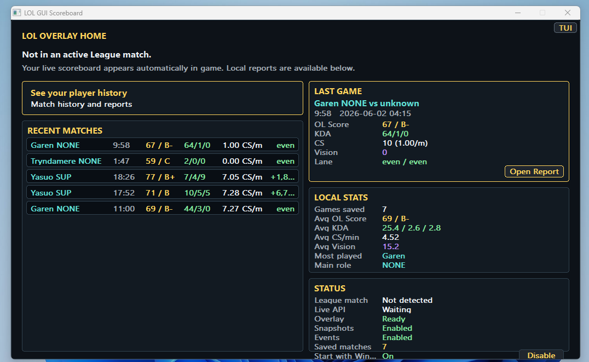
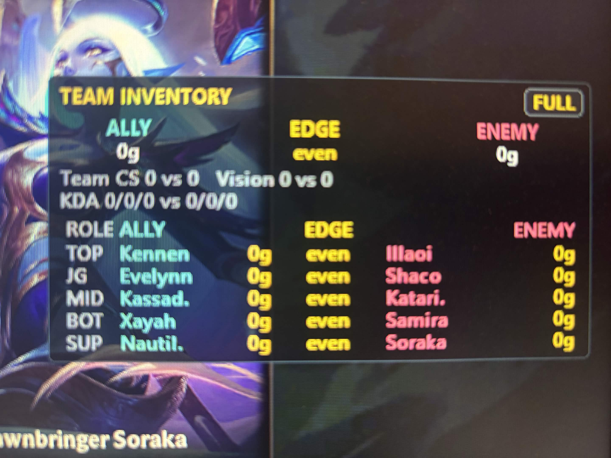
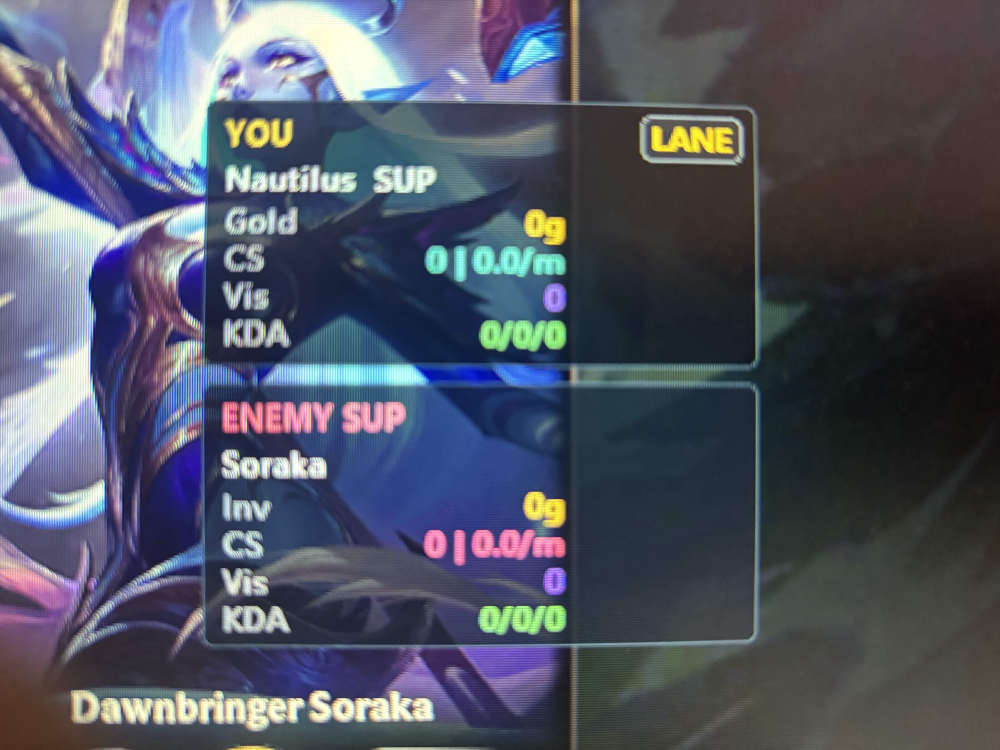
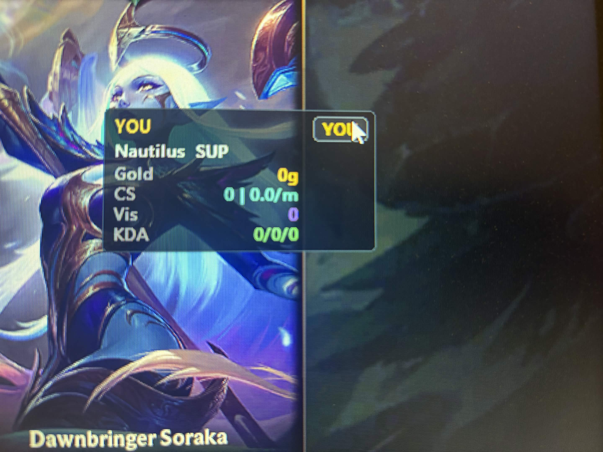
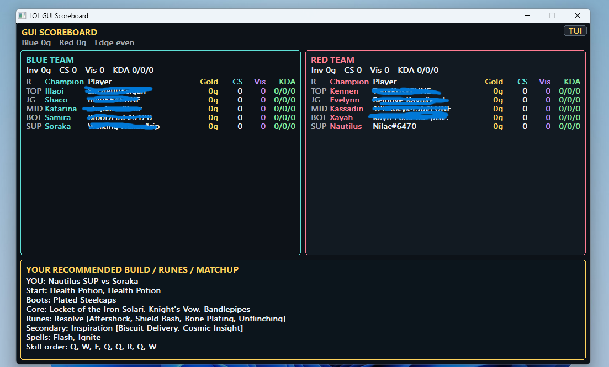
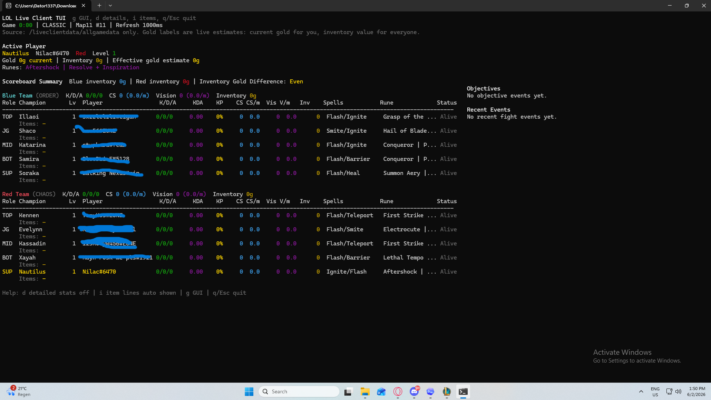
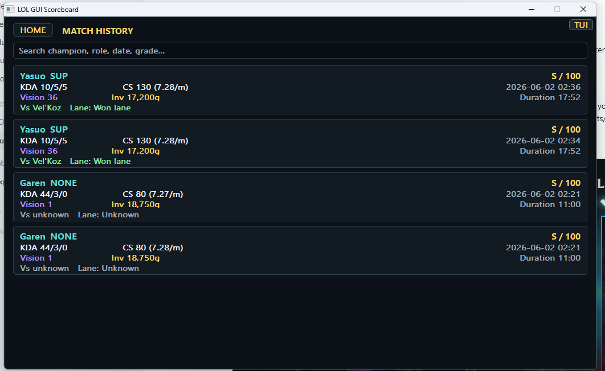
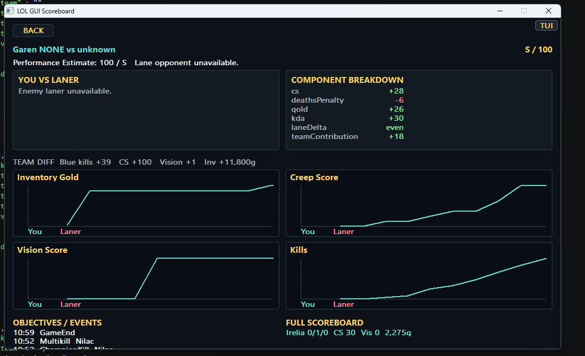
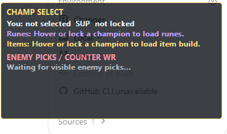
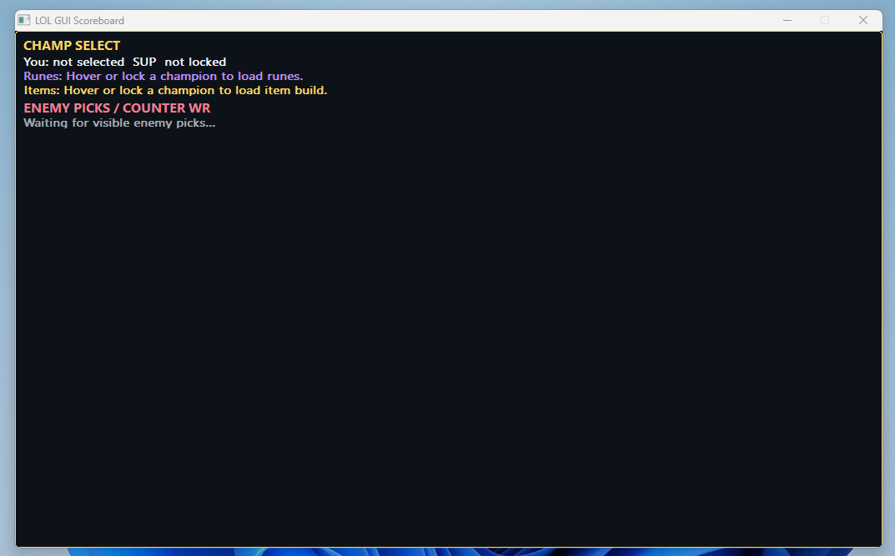

# Open League Overlay

[](#download)
[](CMakeLists.txt)
[](https://github.com/bossNilac/Open-League-Overlay/releases/latest)
[](https://github.com/bossNilac/Open-League-Overlay/actions/workflows/windows-build.yml)
[](LICENSE)

A lightweight Windows companion app for League of Legends with a live overlay, enhanced scoreboard, local match history, and post-game reports.

Open League Overlay is built to stay small and transparent. It reads local League client data, shows useful match information, and keeps saved match data on your machine.

## Download

1. Download the latest Windows x64 zip from [GitHub Releases](https://github.com/bossNilac/Open-League-Overlay/releases/latest).
2. Extract the zip.
3. Run `OpenLeagueOverlay.exe`.
4. Start a League match.

Release users do not need CMake, Ninja, vcpkg, CLion, or other developer tools. The app activates automatically when League live data is available in an active match.

Release downloads include a `.sha256` checksum file. To verify a downloaded zip in PowerShell:

```powershell
Get-FileHash .\OpenLeagueOverlay-v1.0.0-windows-x64.zip -Algorithm SHA256
```

Compare the hash with `OpenLeagueOverlay-v1.0.0-windows-x64.zip.sha256`.

## Preview

Screenshots are intentionally kept out of the repository until they are sanitized. Add censored PNGs with these filenames under `docs/screenshots/` and the previews below will render on GitHub.

See [docs/screenshots/README.md](docs/screenshots/README.md) for capture guidelines.

### GUI Dashboard



### In-Game Overlay







### Scoreboards





### Reports





### Champion Select





## Features

- Live enhanced scoreboard
- Transparent in-game overlay
- TUI scoreboard mode
- GUI dashboard and local match history
- Inventory-value gold estimates
- Player vs lane opponent comparison
- Team summary stats
- Objective and event tracking
- Local post-game reports
- OL Score performance estimate and grade
- Recommended builds, runes, summoner spells, and skill order when available
- Optional rune and item-set export when supported by the local League client
- Optional Start with Windows setting

## How It Works

The app reads live in-game data from the local League Live Client Data API:

`https://127.0.0.1:2999/liveclientdata/allgamedata`

The app only works while League is running and live data is available in an active match. Champ-select features use the local League client lockfile and local client endpoints.

The app:

- Does not inject into League
- Does not hook DirectX
- Does not read game process memory
- Does not automate gameplay
- Does not modify game files
- Does not require a Riot API key for live in-game data
- Does not require a Riot account password

## Gold Values

Enemy unspent gold is not exposed by the Live Client Data API. Enemy gold values shown by this app are visible inventory-value estimates based on items. Treat labels such as `Inventory Gold`, `Visible Item Value`, or `Estimated Inventory Value` as item-value estimates, not exact total gold.

## Local Data and Privacy

Saved game data stays on your machine.

Local data is stored under:

`%LOCALAPPDATA%\OpenLeagueOverlay\`

This includes:

- `settings.json`
- `match_history\`
- `reports\`
- `snapshots\`
- `logs\`
- `cache\`

The app does not upload saved matches, reports, snapshots, event logs, or player data. It does not include telemetry or analytics. GitHub release packages do not include user match history or local settings.

To delete local history and settings, close the app and delete:

`%LOCALAPPDATA%\OpenLeagueOverlay\`

## Installation

1. Download the latest Windows x64 release zip from GitHub Releases.
2. Extract the zip.
3. Run `OpenLeagueOverlay.exe`.
4. Start a League match.
5. The overlay and scoreboard activate automatically when local live data is available.

The release contains clearly named executables:

- `OpenLeagueOverlay.exe` starts the remembered UI mode and provides the TUI when TUI mode is selected.
- `OpenLeagueOverlayGui.exe` is the GUI dashboard and lightweight overlay executable.

The app remembers your last selected UI mode:

- First run opens the GUI dashboard.
- Switching to TUI makes the next launch open TUI.
- Switching back to GUI makes the next launch open GUI.

Advanced command-line options:

```powershell
OpenLeagueOverlay.exe --gui
OpenLeagueOverlay.exe --tui
OpenLeagueOverlay.exe --font-height 10
```
## First Run and Start With Windows

Start with Windows is disabled by default.

On first GUI dashboard launch, the app asks whether it should start automatically when Windows starts. You can choose Enable or Not now. The setting can also be toggled later from the GUI dashboard status card.

Startup uses the per-user registry key:

`HKCU\Software\Microsoft\Windows\CurrentVersion\Run`

Value name:

`OpenLeagueOverlay`

This only launches the local app. It does not upload data or run with administrator privileges.

## Build From Source

Requirements used by this project:

- Windows
- CMake
- Ninja
- MinGW toolchain
- vcpkg dependencies for `curl` and `jsoncpp`

Repository layout:

- `src/` contains application implementation files.
- `src/api/` contains local API transport/parser implementation files.
- `include/` contains project headers.
- `include/api/` contains API-related headers.
- `scripts/` contains developer build and release packaging helpers.

Example build commands from this repository:

```powershell
scripts\build_release.cmd
```

Package a release:

```bat
scripts\package_release.cmd
```

Release output:

`dist\OpenLeagueOverlay-v1.0.0-windows-x64.zip`

The packaging script also writes:

`dist\OpenLeagueOverlay-v1.0.0-windows-x64.zip.sha256`

If you prefer PowerShell directly, use:

```powershell
powershell -NoProfile -ExecutionPolicy Bypass -File scripts\build_release.ps1
powershell -NoProfile -ExecutionPolicy Bypass -File scripts\package_release.ps1
```

The `.cmd` wrappers are included so downloaded source archives can build without changing the system-wide PowerShell execution policy.

## Troubleshooting

No data shown:

You must be inside an active League match for the Live Client Data API to expose game data.

Overlay not visible:

Check that League client/game is focused and that the overlay mode is enabled.

HTTPS or certificate issue:

The app handles the local self-signed Live Client Data API certificate internally.

Missing history:

Match history only exists for games played while the app was running.

Gold values look different from the scoreboard:

Enemy gold is an inventory-value estimate, not exact total gold.

Start with Windows not working:

Check the GUI dashboard setting and Windows startup permissions for the current user.

## Security Notes

- No Riot account password is required.
- No Riot API key is required for live in-game data.
- The app uses the local League Live Client Data API for live in-game data.
- Saved match data stays local under `%LOCALAPPDATA%\OpenLeagueOverlay\`.
- Saved matches, reports, logs, snapshots, cache, and local settings are not included in release packages.
- The app does not upload saved matches or reports.
- No process injection is used.
- No DirectX hooking is used.
- No memory reading is used.
- No gameplay automation is used.
- No game files are modified.
- The executables request normal user privileges only and do not require administrator rights.
- Start with Windows is optional and can be disabled anytime.
- Start with Windows is disabled by default, prompts before enabling, and uses only `HKCU\Software\Microsoft\Windows\CurrentVersion\Run`.
- Enemy gold is an inventory-value estimate, not exact total gold.
- Match history exists only for games played while the app was running.

## Windows Security and SmartScreen

The Windows release is a normal portable zip, not a packed self-extracting launcher. It does not use UPX, bundled installers, hidden updaters, scheduled tasks, or silent startup registration.

Current public builds are unsigned. Because the project is new and unsigned, Microsoft Defender SmartScreen may still warn until the executable earns reputation or the project is code signed. If Windows flags a release that you downloaded from the official GitHub Release, submit the zip or `OpenLeagueOverlay.exe` to Microsoft Security Intelligence for review.
